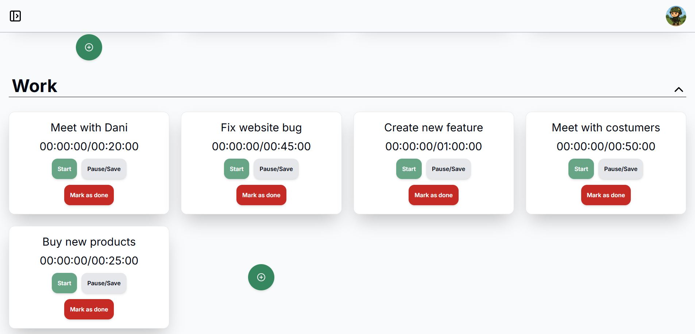
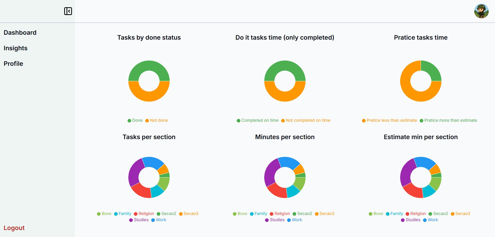
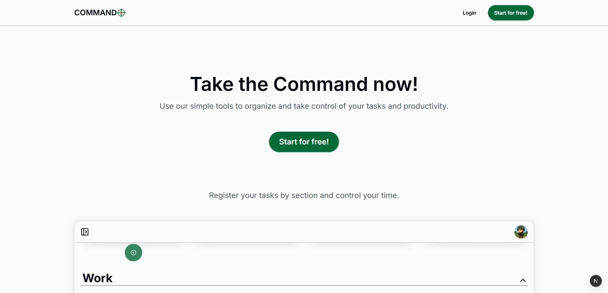
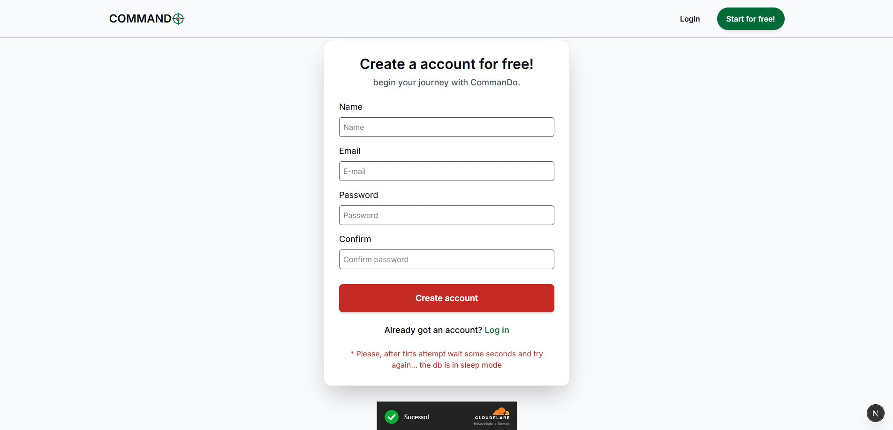
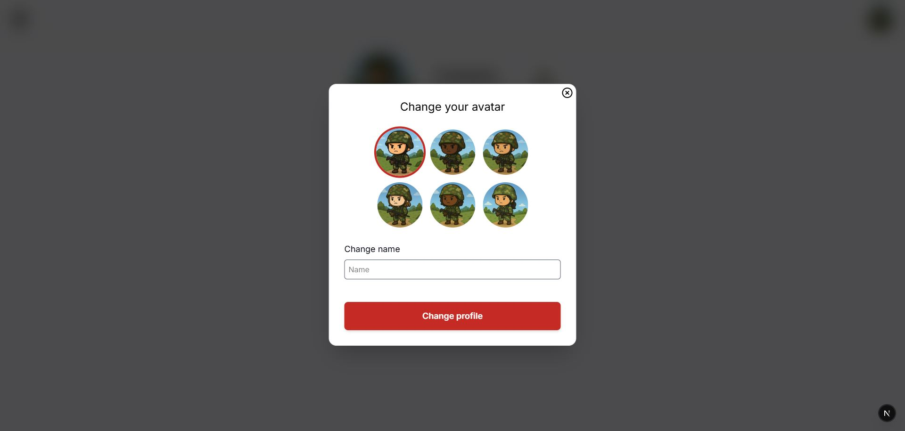

🎯 CommanDo

A military-themed time & task management system with visual insights.
Final Project for CS50x – Introduction to Computer Science (Harvard University)

📌 Table of Contents

Overview

Features

Tech Stack

Project Structure

How It Works

Demo Video

Running Locally

Environment Variables

Screenshots

Future Improvements

Author

🚀 Overview

CommanDo is a productivity and time-management application inspired by military discipline.
Users can create accounts, organize their routine into sections, create tasks (with two task types), track time spent, and view visual insights through dynamic charts.

This project was developed using knowledge gained throughout CS50, combined with my experience as a front-end developer, including learning how to independently explore new technologies.

✨ Core Features
🟩 Authentication & Profile

User registration and login with NextAuth (JWT)

Secure integration with Prisma + PostgreSQL

Users can update name and avatar

🎯 Sections

Users can create “Sections” (like categories: Study, Gym, Work, etc.)
Inside each section they can create tasks.

⏱ Two Smart Task Types

This is the main innovation of the project:

1. Practice Tasks (Pratice Tasks) — time-based completion

User defines a minimum practice time

Timer tracks real execution time

Task is marked as completed automatically (when user saves) once the minimum practice time is reached

Users can keep practicing beyond the minimum time (that’s actually considered good)

2. Do It Tasks

User sets an estimated time to complete the task

Completion must be done manually by the user

After marking as done, the timer cannot continue

Goal: finish it in less time than the estimate

This system creates a unique workflow balancing discipline (Do It) and mastery improvement (Pratice).

📊 Insight Dashboard

Users can open the Insights page and generate visual charts for selected time periods, including:

Tasks Completed (by type)

Estimated vs Real Time

Practice stats

Time spent across Sections

Comparison between tasks

Many custom charts built with Recharts

🧭 Military Theme

The entire UI uses a military style:

Colors inspired by command centers

“CommanDo” naming

Elements styled to look tactical and objective

Future: ranking, achievements, armory, daily missions, etc.

🛠 Tech Stack
Frontend & UI

Next.js 15 (App Router)

React 18

Tailwind CSS

Recharts (interactive charts)

React Hook Form + Zod (forms & validation)

Backend

Next.js Route Handlers

NextAuth (JWT Strategy)

Prisma ORM

PostgreSQL (Neon DB)

Other Tools

Typescript

Turstile (cloudflare)

Vercel (optional for deployment)

CS50 tools & concepts

📁 Project Structure (simplified)
/app
/dashboard
/profile
/insights
/api
/auth
/task
/section
...
/components
/lib
/prisma
public

🎥 Demo Video

(Insert your YouTube link here)

Required by CS50 — please record a 1–3 minute demo.

🖥 How to Run Locally

Clone the project:

git clone https://github.com/TonyzCataldo/Commando.git
cd commando
npm install

Create your .env file:

cp .env.example .env

Fill the environment variables (docs below).

Run database migrations:

npx prisma migrate dev

Run the development server:

npm run dev

Open:
http://localhost:3000

🔐 Environment Variables

Your repository should NOT include the real values.
Only include env.example:

DATABASE_URL=""
NEXTAUTH_SECRET=""
NEXTAUTH_URL=""

These sensitive values must be created manually by anyone running the project.

🖼 Screenshots

🧭 Future Features

🏅 Ranking system

⚔ Armory (skins, badges)

🏅 Achievements system

🎯 Daily missions

📅 Habit streaks

👨‍💻 Author

Antonio Alves Cataldo
Front-End Developer (React, Next.js, TypeScript, Tailwind, Zustand and more)
CS50x 2025 Student

GitHub • LinkedIn
https://github.com/TonyzCataldo // https://www.linkedin.com/in/antonio-alves-cataldo/
